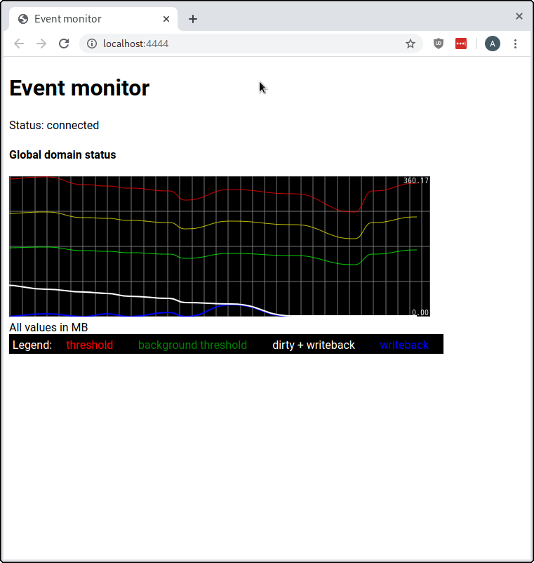

# Methodology / project development {#sec:development}

Carrying out this project required defining an **experiment model**, and the development of different tooling to:

 - Interface with the kernel tracer, and get familiar with the available data.
 - Simulate the behaviour we're trying to analyze, in the form of both offender processes and innocent processes.
 - Automate experiments, and carry them in a controlled environment to make them (more) reproducible.
 - Analyze the resulting data and draw conclusions.

This section walks through the reasoning, design and development of the experiment model and tooling. Specific experiments, results or proof-of-concept development are presented later in section \ref{sec:results}; however, some of the tools were developed in parallel with the experiments.

## Realtime monitor application {#subsec:monitor-app}

Before starting to design the experiments, it was useful to have a bit more of insight into what's happening in the cache. We explored the **kernel tracer** on (section \ref{subsec:tracing}), and found the `global_dirty_state` tracepoint to be of interest, as it holds valuous info that can give us a first overview of the cache state (how many dirty pages exist, thresholds, writeback, ...).

To familiarize ourselves with that data (and also with the kernel tracer) and play around with it, it'll be useful to have some sort of tool that will plot these variables in realtime ---allowing us to quickly see the effects of our actions.

The best tool we had at hand (i.e. had experience working with, and seemed to be simple enough to make it feasible) was to write a Node.JS server together with an appropriate library for the browser, and let them communicate via websockets.

[Node.JS](https://nodejs.org) is a platform for event-driven programming in JavaScript. Since it's based on an event loop and uses the same language as the browser, it was a natural choice for this application. We chose [Express](https://expressjs.com) for the server, [socket.io](https://socket.io) for the client-server communication, and [Smoothie Charts](https://smoothiecharts.org) for the real-time plots.

We won't go into much detail on the development here. First the usual server boilerplate code, which is shown in listing \ref{lst:monitor-server-boilerplate}.
Then we need to set up the tracer (clock \& events) and start it, as shown in listing \ref{lst:monitor-tracer-setup}. Keep in mind that tracefs is mounted on `/sys/kernel/debug/tracing` in old systems, and `/sys/kernel/tracing` on recent ones \cite{docs-tracer-config}.

\begin{listing}
\begin{minted}{js}
    const { writeFileSync, createReadStream } = require('fs')
    const path = require('path')
    const express = require('express')
    const readline = require('readline')
    const { execSync } = require('child_process')

    const app = express()
    const server = require('http').createServer(app)
    const io = require('socket.io')(server)

    app.get('/', (req, res) => {
      res.sendFile(__dirname + '/index.html')
    })
    app.use(express.static(__dirname + '/public'))
    server.listen(4444)
\end{minted}
\caption{Barebones webserver + socket.io code}\label{lst:monitor-server-boilerplate}
\end{listing}

\begin{listing}
\begin{minted}{js}
    const traceFsBase = '/sys/kernel/debug/tracing'

    writeFileSync(path.join(traceFsBase, 'trace_clock'), 'mono')
    writeFileSync(path.join(traceFsBase, 'tracing_on'), '1')

    const subscribeToEvent = (name) => writeFileSync(
      path.join(traceFsBase, 'events', name, 'enable'), '1')

    subscribeToEvent('writeback/global_dirty_state')
    subscribeToEvent('writeback/balance_dirty_pages')
\end{minted}
\caption{Setting up the kernel tracer}\label{lst:monitor-tracer-setup}
\end{listing}

And then the hard part is parsing the events. The ideal way would be to parse the event definitions and subscribe to the binary consumer (or per-cpu binary consumers), but implementing this seemed too much work. Instead we'll choose the text-based interface at `./trace_pipe`, and parse the lines using regular expressions. Once parsed, a `global_dirty_state` event is broadcasted to all client sockets using `io.emit(...)`. Also because of the high-rate of these events, we ended up setting up a timer (`stateTimer`) to filter them. This is shown in listing \ref{lst:monitor-parsing}.

\begin{listing}
\begin{minted}{js}
    const eventsPipe = readline.createInterface({
      input: createReadStream(path.join(traceFsBase, 'trace_pipe')),
    })

    let stateTimer
    eventsPipe.on('line', line => {
      // FIXME: parse timestamp and these other things
      const m = /^[^:]+ ([\d.]+): (\w+): (.+)$/.exec(line)
      if (!m) return console.log('Unparseable event:', util.inspect(line))
      const [ _, timestamp, event, info ] = [...m]
      if (event === 'global_dirty_state') {
        const parsedInfo = {}
        info.split(' ').forEach(x => {
            const m = /^(\w+)=(\d+)$/.exec(x)
            parsedInfo[m[1]] = Number(m[2])
        })
        if (stateTimer) return
        io.emit('global_dirty_state', { ...parsedInfo, pageSize })
        stateTimer = setTimeout(() => stateTimer = null, 100)
      }
    })
\end{minted}
\caption{Receiving and parsing tracer events in text form}\label{lst:monitor-parsing}
\end{listing}

We also had to fix a [bug in Node.JS](https://github.com/nodejs/node/pull/32006) that prevented the `writeFileSync` calls from working. After that, we moved to the client. Again, we won't go into much detail but the JavaScript code is shown in listing \ref{lst:monitor-client-js}. It initializes a Smoothie Charts instance, listens for events from the server, and adds datapoints to the plot (taking care of converting from pages to \si{\mebi\byte}).

\begin{listing}
\begin{minted}{js}
    const socket = io()
    const statusLabel = document.querySelector('.status')
    socket.on('connect', () => statusLabel.innerHTML = 'connected')
    socket.on('disconnect', () => statusLabel.innerHTML = 'disconnected')

    const fromPages = (pages, event) =>
      pages / (1024 * 1024 / event.pageSize)

    setupChart(document.getElementById('chart1'), {
      millisPerPixel: 58,
      grid: { verticalSections: 4 },
      labels: {},
      delay: 0,
      tooltip: true,
    }, [
      {
        init: ts => socket.on('global_dirty_state', x => {
          ts.append(Date.now(), fromPages(x.thresh, x))
        }),
        options: { strokeStyle: 'rgba(255,0,0,0.80)' },
      },
      // ...
      {
        init: ts => socket.on('global_dirty_state', x => {
          ts.append(Date.now(), fromPages(x.dirty + x.writeback, x))
        }),
        options: { lineWidth: 2 },
      },
    ])

    function setupChart(element, options, timeSeries) {
      const chart = new SmoothieChart(options)
      for (const ts of timeSeries) {
        const line = new TimeSeries()
        ts.init(line)
        chart.addTimeSeries(line, ts.options)
      }
      chart.streamTo(element, options && options.delay)
    }
\end{minted}
\caption{Receiving tracer events and plotting them in the browser}\label{lst:monitor-client-js}
\end{listing}

{#fig:monitor-screenshot width=100% height=100%}

The application is now finished and may be browsed at <http://localhost:4444>. Figure \ref{fig:monitor-screenshot} shows a screenshot. The full source code may be found in the `monitor` directory of the annex.

**Important:** Because unresponsiveness may freeze the browser itself (this should theoretically not happen to the server, but I didn't verify), it's *highly recommended* to browse the plots from another computer. Ideally, we should parse the event timestamps and use those, but this probably requires clock synchronization and wasn't deemed worthy.

## Experiment model {#subsec:experiment-model}

First task is to define the setup we'll use to run experiments. Since there aren't explicit parameters to touch and debugging is difficult, we'd like our experiments to be as *reproducible and clear* as possible while making it easy to play different configurations. We should *log all experiment parameters* to make it easy to identify and re-run previous experiments should we need it.

System unresponsiveness is subjective. But the basic idea is that in the presence of an offending (fast writing) process, other processes appear to be blocked for long amounts of time when submitting I/O. This gives us a straightforward way to proceed: we'll run a series of 'innocent' processes in the background, which will periodically attempt to do I/O and will log the time each attempt takes. If our assumption is true, reducing those pauses should improve responsiveness.

#### Loads

As we said before, we need to code 'innocent' processes that will periodically submit some I/O operations and log the time each one takes. This will be our primary way to observe and validate unresponsiveness.

However, to trigger this unresponsiveness, we'll also need some faux 'offender' processes which will constantly write to disk in an unbounded way. Logically, it would also be helpful to visualize the times that *this* I/O takes, to compare them with the innocent ones.

This gives us a basic structure for each of the processes in our experiment, which we'll call 'loads':

~~~ python
times = []
while True:
  # execute load-specific task
  cycle()
  # log current time
  times.append( gettime() )

# once experiment finishes
print(times)
~~~

For an **innocent load**, `cycle` will consist of an I/O task followed by a sleep:

~~~ python
test_file = open('test_file', 'w')

def cycle():
  test_file.write('hello\n')
  sleep(0.1)
~~~

While for an **offender load**, the sleep will be omitted and the I/O can be submitted in larger blocks to put more pressure:

~~~ python
test_file = open('test_file_2', 'w')
block = bytes([ 0xFF ] * 4096)

def cycle():
  test_file.write(block)
~~~

Then, by inspecting the logged times (their differences), we can detect if any part of the cycle took more than expected, how much, and when it happened.

There is a reason for buffering the times into memory and logging them at the end: to avoid the logging *itself* from blocking (thus altering the results). From the kernel's perspective we want these processes to strictly submit I/O and sleep, nothing more.

It is also important to have a **control load**, which will do zero I/O; its cycle can just be a sleep. This will let us be sure the pauses we observe are strictly because of I/O, and not other system unstabilities (long interrupts, CPU exhausted, etc.) and make sure our experiment runs in good conditions:

~~~ python
def cycle():
  sleep(0.1)
~~~

#### Coding the loads

To make it easy, we'll write a single executable that will implement the many kinds of load (innocent, offender, control) we'll need, and the kind (cycle function to use) will be specified via command-line arguments.

Of course, we'd like all of these parameters (block size, sleep time, ...) to be configurable for every process. We'll also need them to operate on different files to avoid colliding, as we might wish to have multiple innocent loads of the same kind.

Also, experiments need a stopping condition. We could define a duration, but ---for reasons explained later--- it was decided to just make the offender load stop after writing a number of bytes. The other loads can then be told to stop by interrupting them (i.e. pressing Control+C or sending SIGINT).

In addition, we'd like the offender load to start after some seconds so we can compare how the system was before applying pressure. We could run the load at a later time, but to simplify the experiment setup as much as possible, we decided to code this into the load, making the first cycle be a sleep for a configurable number of seconds.

\begin{table} \hypertarget{table:loads-initial}{%
  \centering
  \input{img/development/initial_loads.tex}
  \caption{Kinds of load initially implemented for experiments}\label{table:loads-initial}
} \end{table}

The kinds of load that were initially implemented are described in table \ref{table:loads-initial}. Note that we used a `load` identifier for the offender kind. It would have been less confusing to use `offender`, but at the point this was realized it was difficult to change.

Also note that there's two kinds of innocent loads, **write** and **multiwrite**. The second one is similar to the first, but writes in a (newly created) different file each time. Therefore, its cycle consists of an `openat` followed by a `write` and sleep. It was implemented after some preliminary tests that seemed to indicate `openat` is more prone to blocking than `write`.

Now that we've defined the behaviour of the load executable and how it is parameterized, it's time to code it. We chose **Python** for the task, because it is high-level and easy to work with, but at the same time offers an extense API that still maps pretty much one-to-one with syscalls. For situations where we'd need precise control, it ships with `ctypes`, a low-level \ac{FFI} interface. For this reason, low-level exploits are often implemented in Python.

First we need to define and parse the command-line arguments, which will be:

~~~ bash
./load.py <name> <kind> [<parameter>...]
# example load invocations:
./load.py c1 control '0.05'
./load.py mw1 multiwrite /tmp/mw1 '0.1'
./load.py l1 load /tmp/load1 43 32000000 512
~~~

And at the end, we'll use `pickle` to serialize the times into a file named after the load's name. This file will contain additional info, such as the kind and parameters, and the PID (so we can later correlate it with kernel debugging info):

~~~ python
with open('load.{}.pkl'.format(name), 'wb') as out:
    pickle.dump({
        'pid': os.getpid(),
        'kind': kind,
        'params': dict(params),
        'times': times,
    }, out)
~~~

Finally we used `strace` to make sure the loads behaved correctly from kernel's perspective (no extra syscalls, etc.):

~~~
$ strace ./load.py mw1 multiwrite /tmp/mw1 '1'
[...]
select(0, NULL, NULL, NULL, {tv_sec=1, tv_usec=0}) = 0 (Timeout)
openat(AT_FDCWD, "/tmp/mw1.2", O_WRONLY|O_CREAT|O_TRUNC|O_CLOEXEC, 0666) = 3
fstat(3, {st_mode=S_IFREG|0644, st_size=0, ...}) = 0
write(3, "test", 4)                     = 4
close(3)                                = 0
select(0, NULL, NULL, NULL, {tv_sec=1, tv_usec=0}) = 0 (Timeout)
openat(AT_FDCWD, "/tmp/mw1.3", O_WRONLY|O_CREAT|O_TRUNC|O_CLOEXEC, 0666) = 3
fstat(3, {st_mode=S_IFREG|0644, st_size=0, ...}) = 0
write(3, "test", 4)                     = 4
close(3)                                = 0
select(0, NULL, NULL, NULL, {tv_sec=1, tv_usec=0}
~~~

Other than the extra `fstat` issued after opening the file, all kinds seemed to behave correctly. The full source code of `load.py` is listed at appendix \ref{subsec:code-load}.
<!-- and may also be found in the submitted annex under the `analysis` folder. (removed because it breaks layout) -->

## Virtual environment

At this point, we just need a main script to run a set of loads and stop them at the end. We'll create a dedicated directory for each experiment we run. Listing \ref{lst:simple-exp} shows a base experiment script we prepared, which includes two offenders kicking in at different times, two innocent loads (write \& multiwrite) and a control one.

\begin{listing}
\begin{minted}{bash}
    #!/bin/bash
    set -e

    # create experiment directory
    EXPDIR="exps/$(date +%Y-%m-%d_%H-%M)"
    mkdir "$EXPDIR"; cd "$EXPDIR"
    echo "Starting experiment: $EXPDIR"

    # start loads
    mkdir loads
    ./load.py c1 control '0.05'
    ./load.py w1 write loads/write1 '0.05'
    ./load.py mw1 multiwrite multiwrite1 '0.1'
    ./load.py l2 load loads/load2 43 12000000  512
    ./load.py l1 load loads/load1  5 30000000 1024

    # wait for main load to end, stop rest, clean up
    wait -n; jobs -p | xargs kill -INT; wait
    rm -r loads
    echo "-- Done --"
\end{minted}
\caption{Base experiment session}\label{lst:simple-exp}
\end{listing}

This is good to get started, but we'd like to have a better control of the environment. A virtual machine of some sort would be ideal here, because it would make our experiments much more *reproducible* by offering:

 - Precise control of almost every parameter, including system memory, cache thresholds, filesystem type \& size, bandwidth throttling...

 - Kernel flexibility: it makes it easy to test many kernels (or kernel modifications) and gives us precise control of the config; we may enable / disable whatever modules or knobs we might need.

 - Isolation: only our processes are running, many experiments can run in parallel, it's difficult for an experiment to alter the next, ... This also means less junk data when we start tracing kernel events.

 - Safety: we'll be doing writing high-speed during a long time, which can burn out the disk. A VM lets us simulate one from memory.

While difficult, if we were able to reproduce realist unresponsiveness inside a VM, it would make things *incredibly* easier. So, trying it seemed worthy. From the options we researched, **User Mode Linux** (detailed in section \ref{subsec:other-technologies}) seemed the most ideal one. It has:

 - Portable \& compact setup: Unlike other VM solutions, there's no need for root, dedicated software, loading kernel modules or specific system configuration steps. Everything can run right off from a script.

 - Easy to use: With use of some clever techniques, there's no need to prepare a rootfs or disk drive image to boot off. UML also integrates effortlessly with the host filesystem. This also means it's...

 - Automatable: We'll likely start lots of tests; it would be good to reduce the amount of effort \& steps needed to run one. UML is very easy and intuitive to automate, allowing us to reduce this effort to zero!

So, we start by cloning Linux and compiling a stock UML kernel:

~~~ bash
git clone https://github.com/torvalds/linux.git && cd linux
ARCH=um make defconfig
ARCH=um make
~~~

We can now run it (`./linux`) and verify it boots correctly. However it needs a root FS. Typically we would download an image from the Internet and load it as a block device, but there's a clever way to avoid this altogether. Remember UML has hostfs which exposes the host files. Well, we can specify this as the root filesystem:

~~~ bash
./linux rootfstype=hostfs init=/bin/bash
~~~

It works! This should be considered a hack, because of hostfs drawbacks mentioned in section \ref{subsec:other-technologies}, and should **not** be used to boot a real `init` because it will attempt to modify your actual system's files. But in our case, coding a custom `init` is fine! It will require some extra setup \& cleanup code, but will give us much more control and will make everything more compact.

So, the idea is to create an `experiment.py` script that will:

 1. Launch the kernel, specifying *itself* as `init`.
 2. When launched as init inside the kernel (which can be detected by checking PID = 1), set up the machine.
 3. Start the loads.
 4. Wait for them to finish; clean up.

This will work as long as there's no spaces or other control characters in the path we're working on. Some init-related tasks we should totally do are: mounting procfs, sysfs and the like, and syncing data before finishing.

A template script that performs all this is presented in listing \ref{lst:uml-scaffolding}. We chose Python as well, for the same reasons. Also note that we can't just exit when we're done, that's a kernel panic. To do things correctly, we should *power down* the kernel. This is done via the ominous `reboot` syscall, which is only supposed to be invoked by init and not exposed to Python, so we had to use the FFI to call it. Any exceptions result in kernel panic and get correctly propagated to the main script, which is nice.

\begin{listing}
\begin{minted}{python}
    from subprocess import run
    from os.path import dirname, join, abspath
    import ctypes
    libc = ctypes.CDLL(None)

    def main():
      print('Running kernel...')
      run(check=True, args=['./linux', 'rootfstype=hostfs', 'rw',
                            'init=' + abspath(__file__) ])
      print('Done!')
    
    def inside_kernel():
      print('Inside kernel!')
      run(check=True, args=[ 'mount', '-t', 'proc', 'none', '/proc' ])
      run(check=True, args=[ 'mount', '-t', 'sysfs', 'none', '/sys' ])
      # ...

      # TODO: perform experiment

      # power down
      libc.syncfs(os.open('/', 0))
      libc.reboot(0x4321fedc)

    if os.getpid() == 1:
      inside_kernel()
    else:
      main()
\end{minted}
\caption{Barebones script that runs itself inside a UML kernel}\label{lst:uml-scaffolding}
\end{listing}

#### Putting it together

Now that we have the tools we need, we can finally put together the script to launch the UML, set it up and start the loads. We need to create a block device that will hold the filesystem that loads will operate on. It must be in RAM to avoid burning out our disk. We'll use the following approach:

 - Create a temporary file at `/var/run/user/` (which unlike `/tmp` is guaranteed to be a tmpfs) which will hold the filesystem on which loads will operate. Allocate \SI{130}{\mega\byte} of space to it. Initialize it with 0xFF bytes, and format it as **ext4**. Pass it as `ubdb=file`.

 - When inside the kernel, mount the block device:
   `mount /dev/ubdb /mnt`

 - Through the root blkio cgroup, throttle the write bandwidth to this block device to \SI{1}{\mega\byte\per\second}. This would be done in Bash as follows:
   
   ~~~ bash
   mount -t tmpfs  none /sys/fs/cgroup
   mount -t cgroup none /sys/fs/cgroup/blkio -o blkio
   echo `stat -c%t:%T /dev/ubdb` 1000000 \
     > /sys/fs/cgroup/blkio/blkio.throttle.write_bps_device
   ~~~

We studied other approaches which would behave more closely like a real disk, such as doing the throttling in the host, or writing a fake block device driver, but ultimately decided to go with that one.

Other things to keep in mind:

 - Before launching the kernel, create an experiment directory. Pass this directory as an `init` argument into the inner script and change to it.

 - We should also remember to adjust the amount of memory when launching the kernel to \SI{150}{\mega\byte}, because it's an important parameter since it indirectly determines the writeback cache thresholds. We will leave these thresholds set to their defaults (background \SI{10}{\percent}, normal \SI{20}{\percent}).

All of these sizes should be configurable parameters of the experiment as well. Before starting the loads, we'll save them in `experiment.json` together with kernel version and some other info, to make it easy to reproduce the experiment in the future:

~~~ python
with open('experiment.json', 'w') as f:
  json.dump({
    'kind': 'uml',
    'start': datetime.datetime.now().isoformat(),
    'kernel': os.uname().release,
    'write_bps': write_bps,
    'dev_size': dev_size,
    'memory': memory,
  }, f, indent=4)
  f.write('\n')
~~~

At this point, and not after a few fixes, we have a fully functional experiment script that prepares the filesystem, boots the kernel, starts the experiment and cleans up. Nice!

#### Kernel tracing

We'd also like to incorporate data from the kernel tracer, which was previously explored in sections \ref{subsec:tracing} and \ref{subsec:monitor-app}. This time we don't want to visualize it in real time, we just need to log it among with the rest of the experiment's data.

`trace-cmd` can do that for us, as well as setting up the tracer, and using `splice` to make sure the kernel moves the data to the disk without any userspace intervention.
However because the tracer's data will be logged to disk, and probably interact with the writeback cache, there is potential for this logging altering the results of the experiment. Ideally, this data should be sent over a set of network sockets (again using `splice`) and written on another machine[^tracer-network]. However we'll only be logging a few events for now, and the data volume was confirmed to be low. Experiment data is in another filesystem as well.

[^tracer-network]: At a later time we realized that `trace-cmd` has this feature built in, and with reasonable effort we could probably have implemented it, starting the receiver outside of the UML.

So, we'll modify `experiment.py` to start up `trace-cmd` before the loads:

~~~ python
add_task('trace-cmd record -e balance_dirty_pages -e global_dirty_state')
time.sleep(3) # wait for it to start up
~~~

And then kill it afterwards, and wait for it to finish. We'll also check for dropped tracer events before exiting, see listing \ref{lst:dropped-events}. Since we're using `splice` this shouldn't happen, but just in case.

\begin{listing}
\begin{minted}{python}
    base = '/sys/kernel/tracing/per_cpu'
    for cpu in os.listdir(base):
        with open(join(base, cpu, 'stats')) as f:
            stats = dict( re.fullmatch(r'(.+?): (.*)', x.rstrip()).groups() for x in f )
        lost = int(stats['overrun']) + int(stats['dropped events'])
        if lost:
            raise Exception('{} lost events on {}'.format(lost, cpu))
\end{minted}
\caption{Checking for dropped tracer events}\label{lst:dropped-events}
\end{listing}

We run a full experiment and verify that we end up with `trace.dat` along with the rest of the expected files:

~~~
$ ./analysis/experiment.py 
Preparing experiment at: /home/alba/Documents/tfg/exp/_06-16_12-17
-- Creating block device --
-- Formatting --
mke2fs 1.45.6 (20-Mar-2020)
/run/user/1000/tmplvhupg6q contains `ISO-8859 text, with very long lines, with no line terminators' data
Es descarten els blocs del dispositiu: fet                            
S'està creant un sistema de fitxers amb 133120 1k blocs i 33320 nodes-i
UUID del sistema de fitxers=0773a3aa-099c-4621-8f81-ee481abc58a8
[...]
Escriptura de la informació dels superblocs i de comptabilitat del sistema de fitxers:fet  

-- Launching kernel --
Core dump limits :
	soft - NONE
	hard - NONE
Checking that ptrace can change system call numbers...OK
Checking syscall emulation patch for ptrace...OK
Checking advanced syscall emulation patch for ptrace...OK
Checking environment variables for a tempdir...none found
Checking if /dev/shm is on tmpfs...OK
Checking PROT_EXEC mmap in /dev/shm...OK
Adding 6578176 bytes to physical memory to account for exec-shield gap
Linux version 5.6.0-rc7-alba1-01120-g83fd69c93340 (alba@alba-tpi) (gcc version 9.3.0 (Arch Linux 9.3.0-1)) #3 Sat Jun 13 01:38:53 CEST 2020
Built 1 zonelists, mobility grouping on.  Total pages: 39380
Kernel command line: mem=150M root=/dev/root rootfstype=hostfs rw ubdb=/run/user/1000/tmplvhupg6q init=/home/alba/Documents/tfg/analysis/experiment.py -- /home/alba/Documents/tfg/exp/_06-16_12-17
Dentry cache hash table entries: 32768 (order: 6, 262144 bytes, linear)
Inode-cache hash table entries: 16384 (order: 5, 131072 bytes, linear)
mem auto-init: stack:off, heap alloc:off, heap free:off
Memory: 144708K/160024K available (3282K kernel code, 1153K rwdata, 1116K rodata, 145K init, 175K bss, 15316K reserved, 0K cma-reserved)
NR_IRQS: 16
[...]
printk: console [tty0] enabled
Initializing software serial port version 1
printk: console [mc-1] enabled
Failed to initialize ubd device 0 :Couldn't determine size of device's file
VFS: Mounted root (hostfs filesystem) on device 0:14.
devtmpfs: mounted
This architecture does not have kernel memory protection.
Run /home/alba/Documents/tfg/analysis/experiment.py as init process
random: python3: uninitialized urandom read (24 bytes read)
-- Inside kernel --
-- Mounting things --
-- Throttling bandwidth --
-- Mounting FS --
EXT4-fs (ubdb): mounting ext2 file system using the ext4 subsystem
EXT4-fs (ubdb): mounted filesystem without journal. Opts: (null)
ext2 filesystem being mounted at /mnt supports timestamps until 2038 (0x7fffffff)
-- Preparing --
-- Starting experiment --
Hit Ctrl^C to stop recording
random: python3: uninitialized urandom read (24 bytes read)
random: python3: uninitialized urandom read (24 bytes read)
random: python3: uninitialized urandom read (24 bytes read)
random: fast init done
------------[ cut here ]------------
WARNING: CPU: 0 PID: 0 at lib/refcount.c:28 refcount_warn_saturate+0x13f/0x141
refcount_t: underflow; use-after-free.
[...]
---[ end trace d6f8d67503c36ee4 ]---
CPU0 data recorded at offset=0xb2000
    5746688 bytes in size
-- Powering off --
reboot: System halted

-- Completed successfully --
Results at: 06-16_12-17

$ ls exp/06-16_12-17
experiment.json  load.l1.pkl  load.mw1.pkl  trace.dat
load.c1.pkl      load.l2.pkl  load.w1.pkl
~~~ 

The full source code of `experiment.py` is listed at appendix \ref{subsec:code-experiment} and may be found in the submitted annex as well, under the `analysis` folder.

#### Other considerations

As can be seen in the previous log, a trace appears in the middle of the experiment, and it seems to be related to the UBD driver:

~~~
------------[ cut here ]------------
WARNING: CPU: 0 PID: 0 at lib/refcount.c:28 refcount_warn_saturate+0x13f/0x141
refcount_t: underflow; use-after-free.
Modules linked in:
CPU: 0 PID: 0 Comm: swapper Not tainted 5.6.0-rc7-alba1-01120-g83fd69c93340 #3
Stack:
 6047eed0 6033c60b 00000009 6047ef60
 00000000 6025a5fd 6047eee0 6033c650
 6047ef40 6003a8d7 6047ef30 1c6004f0b1
Call Trace:
 [<6006dc16>] ? printk+0x0/0x94
 [<6001f67a>] show_stack+0x13b/0x155
 [<6033c60b>] ? dump_stack_print_info+0xdf/0xe8
 [<6025a5fd>] ? refcount_warn_saturate+0x13f/0x141
 [<6033c650>] dump_stack+0x2a/0x2c
 [<6003a8d7>] __warn+0x107/0x134
 [<6022b1bb>] ? blk_queue_max_discard_sectors+0x0/0xd
 [<6003ada9>] warn_slowpath_fmt+0xd1/0xdf
 [<6003acd8>] ? warn_slowpath_fmt+0x0/0xdf
 [<6001f739>] ? timer_read+0x10/0x1c
 [<6024a1ee>] ? bfq_put_queue+0x40/0x1f9
 [<600789a6>] ? raw_read_seqcount_begin.constprop.0+0x0/0x15
 [<6003192f>] ? os_nsecs+0x1d/0x2b
 [<6025a5fd>] refcount_warn_saturate+0x13f/0x141
 [<6022f676>] refcount_sub_and_test.constprop.0+0x32/0x3a
 [<602302ca>] blk_mq_free_request+0xf6/0x112
 [<602303f2>] __blk_mq_end_request+0x10c/0x114
 [<6002b1bc>] ubd_intr+0xb5/0x169
 [<6006ea31>] __handle_irq_event_percpu+0x6b/0x17e
 [<6006eb6a>] handle_irq_event_percpu+0x26/0x69
 [<6006ebd3>] handle_irq_event+0x26/0x34
 [<6006ebad>] ? handle_irq_event+0x0/0x34
 [<60072160>] ? unmask_irq+0x0/0x37
 [<600727c0>] handle_edge_irq+0xbc/0xd6
 [<6006e314>] generic_handle_irq+0x21/0x29
 [<6001ddd4>] do_IRQ+0x39/0x54
 [<6001de96>] sigio_handler+0xa7/0x111
 [<60030db5>] sig_handler_common+0xa6/0xbc
 [<6001f7a0>] ? timer_handler+0x0/0x48
 [<60031137>] ? block_signals+0x0/0x11
 [<60030e27>] ? timer_real_alarm_handler+0x5c/0x5e
 [<602576ae>] ? find_next_bit+0x1b/0x1d
 [<6007638e>] ? __next_timer_interrupt+0x78/0xd0
 [<600773d1>] ? arch_local_irq_save+0x22/0x29
 [<60077d8c>] ? hrtimer_get_next_event+0x59/0x61
 [<60031137>] ? block_signals+0x0/0x11
 [<600311c4>] unblock_signals+0x7c/0xd7
 [<60039e2b>] ? kernel_thread+0x0/0x4e
 [<6001e928>] arch_cpu_idle+0x54/0x5b
 [<60031137>] ? block_signals+0x0/0x11
 [<60350013>] default_idle_call+0x32/0x34
 [<6005f26f>] do_idle+0xaa/0x127
 [<6034d8e9>] ? schedule+0x99/0xdd
 [<6005f1c5>] ? do_idle+0x0/0x127
 [<6005f540>] cpu_startup_entry+0x1e/0x20
 [<6005f522>] ? cpu_startup_entry+0x0/0x20
 [<60053cf2>] ? find_task_by_pid_ns+0x0/0x2d
 [<6034c675>] rest_init+0xc2/0xc7
 [<6003121f>] ? get_signals+0x0/0xa
 [<60345994>] ? strlen+0x0/0x11
 [<600016bc>] arch_call_rest_init+0x10/0x12
 [<60001d26>] start_kernel+0x663/0x672
 [<600036be>] start_kernel_proc+0x49/0x4d
 [<6006b3d1>] ? kmsg_dump_register+0x70/0x78
 [<6001e3e4>] new_thread_handler+0x81/0xb2
 [<60003673>] ? kmsg_dumper_stdout_init+0x1a/0x1c
 [<60021049>] uml_finishsetup+0x54/0x59

---[ end trace d6f8d67503c36ee4 ]---
~~~

After some amount of effort, we were able to bisect this bug to [patch `ecb0a83e3`](https://github.com/torvalds/linux/commit/ecb0a83e3198f2c1142901687afacbc73602a13b) which first appeared in Linux 4.20-rc1. To reproduce, `CONFIG_REFCOUNT_FULL` has to be enabled on old versions before it was made default and the option removed.

We [notified](http://lists.infradead.org/pipermail/linux-um/2020-March/003031.html) the linux-um mailing list with that info. Nevertheless, the system continues working correctly after the trace and data is flushed to the block device, so we decided to move on.

## Data analysis {#subsec:timeline-analysis}

After we can run experiments, we need a way to visualize the resulting data and see what's going on. We'll build a tool to render a **timeline** showing where the pauses occur on each load and how much they took. It should also plot the data from the kernel tracer, in a similar way to what we did in the monitor application (section \ref{subsec:monitor-app}). We'll use a [Jupyter](https://jupyter.org) + [NumPy](https://numpy.org) + [Matplotlib](https://matplotlib.org) setup, which is typical in data science.

For the impatient, the finished product can be seen later in the analysis section, see figure \ref{fig:tl-uml-simple} for an example. We'll now present the structure of the code in a simplified way, see the full source code for reference.

#### Basic timeline

Let's omit the tracer data for now. Listing \ref{lst:timeline-parsing} shows code for loading data from a particular experiment, given the directory name of the experiment (timestamp). It populates `expdata` and a `loads` dictionary.

\begin{listing}
\begin{minted}{python}
    import os
    from os.path import join
    import re
    import json
    import pickle
    import numpy as np

    expname = '04-11_05-01' # experiment to load

    expbase = join('../exp', expname)
    with open(join(expbase, 'experiment.json')) as f:
      expdata = json.load(f)
    expfiles = os.listdir(expbase)
    loads = {}
    for x in expfiles:
      if m := re.fullmatch(r'load\.(.+)\.pkl', x):
        with open(join(expbase, x), 'rb') as f:
          load = pickle.load(f)
          load['times'] = np.array(load['times'])
          loads[m.group(1)] = load
\end{minted}
\caption{Loading \& parsing experiment data}\label{lst:timeline-parsing}
\end{listing}

Then the visualization code. First we need to extract the experiment's start and end timestamps; we can do that by looking at the initial and final times of one of the loads:

~~~ python
start, end = loads['c1']['times'][[0,-1]]
# all plotted timestamps will be relative to start
~~~

One way to visualize cycle times is to plot steps, one for each cycle. Each step will start & end when the cycle begins or ends, and the height of the step will also correspond to the cycle time. In other words, we'll be drawing a sequence of *squares* whose sides are the cycle times (of course, X and Y axis will be scaled differently so they will render as rectangles). We made a helper for that:

~~~ python
def render_segments(ax, edges, values, *args, **kwargs):
  if len(edges) != len(values)+1:
    raise Exception('Got {} edges, {} values'.format(len(edges), len(values)))
  res = ax.fill_between(np.repeat(edges, 2)[1:-1], np.repeat(values, 2), -1, *args, **kwargs)
  ax.set_ylim(0, ax.get_ylim()[1])
  return res

# ...
ax.set_title('cycle times of the c1 load')
ts = loads['c1']['times'] - start
render_segments(ax, ts, np.diff(ts))
~~~

Since our timeline will have different *panes* with a shared X (temporal) axis, and because many of these panes will share the same logic, we'll define functions to render each kind of pane given the `Axes` object and some parameters. This allows us to add, remove or reorder them easily. Listing \ref{lst:timeline-load-panes} shows the panes for a control load, offender load, and innocent load respectively. On innocent loads, we subtract the idle parameter (sleep) from the cycle time. On offender loads, we discard the first cycle since it's a big sleep.

\begin{listing}
\begin{minted}{python}
    def p_control_task(ax, ln='c1'):
      load = loads[ln]; ps = load['params']; ts = load['times'] - start
      ax.set_title('{} control task (cycle time)'.format(ln))
      render_segments(ax, ts, np.diff(ts))
      ax.set_ylim(ps['idle']*(1-.05), ps['idle']*1.25)

    def p_load_task(ax, ln='l1'):
      load = loads[ln]; ps = load['params']; ts = load['times'] - start
      ax.set_title('{} {} task (cycle time)'.format(ln, load['kind']))
      ts = ts[1:]
      render_segments(ax, ts, np.diff(ts))

    def p_idle_task(ax, ln='w1'):
      load = loads[ln]; ps = load['params']; ts = load['times'] - start
      ax.set_title('{} {} task (cycle time minus idle)'.format(ln, load['kind']))
      render_segments(ax, ts, np.diff(ts) - ps['idle'])
\end{minted}
\caption{Pane logic for load cycle times}\label{lst:timeline-load-panes}
\end{listing}

Once this is done, we can define a list of panes (their height, function and parameters) and create a blank figure using `subplots`. Then invoke the functions to render each axis, some other code to set up ticks and labels, and we get the result. This is shown in listing \ref{lst:timeline-render}.

\begin{listing}
\begin{minted}{python}
    panes = [
      (0.5, p_control_task, dict()),
      (1, p_load_task, dict(ln='l1')),
      (1, p_idle_task, dict(ln='mw1')),
      (1, p_load_task, dict(ln='l2')),
      (1, p_idle_task, dict(ln='w1')),
    ]
    fig, axs = subplots(sharex=True, figsize=(10,8), tight_layout=True, nrows=len(panes), gridspec_kw=dict( height_ratios=[ x[0] for x in panes ] ))
    axs[-1].set_xlim(0, end - start)
    axs[-1].set_xlabel('time [s]')
    axs[-1].xaxis.set_major_locator(mpt.MultipleLocator(10))

    for ax, (_, fn, kwargs) in zip(axs, panes):
      ax.yaxis.set_major_formatter(mpt.EngFormatter(sep='', unit='s'))
      fn(ax, **kwargs)

    for ax in axs:
      for load in loads.values():
        if load['kind'] == 'load':
          ax.plot([ load['times'][1] - start ]*2, ax.get_ylim(), lw=1, ls=(0, (4,4)), color='black')
\end{minted}
\caption{Rendering the whole timeline}\label{lst:timeline-render}
\end{listing}

\clearpage

#### Tracer data

Now it's time to add in the info from the tracer events. As mentioned in section \ref{subsec:tracing}, `trace-cmd` includes a Python interface. It's not very well maintained and we were unable to determine clearly if the intent of this interface was to provide a means to write plugins, or to be used as a library in regular Python scripts (our case), or both \cite{trace-cmd-python-plugin-docs}.

In any case, the Python bindings ended up installed at `/usr/lib/trace-cmd/python` but when we tried to load them, we got linking errors:

~~~
$ export PYTHONPATH=/usr/lib/trace-cmd/python
$ python
Python 3.8.1 (default, Jan 22 2020, 06:38:00) 
[GCC 9.2.0] on linux
Type "help", "copyright", "credits" or "license" for more information.
>>> import ctracecmd
Traceback (most recent call last):
  File "<stdin>", line 1, in <module>
ImportError: /usr/lib/trace-cmd/python/ctracecmd.so: undefined symbol: tracecmd_append_cpu_data
>>> 
$ ldd /usr/lib/trace-cmd/python/ctracecmd.so 
	linux-vdso.so.1 (0x00007fffbbd57000)
	libc.so.6 => /usr/lib/libc.so.6 (0x00007f31765a2000)
	/usr/lib64/ld-linux-x86-64.so.2 (0x00007f317685a000)
~~~

To get the library to load, we needed to look up the missing symbols and remove them from the source code (it looks as if the definition was removed, but some undefined references were left). We also needed to modify the Makefile so it would build correctly.

That wasn't enough, because the code was for a very old version of Python 2 that used things like `DictMixin`. After this and several other fixes, we got the code working and were able to open the `trace.dat` file and parse it. Horray!

~~~ python
import tracecmd
trace = tracecmd.Trace('path/to/trace.dat')
trace.read_next_event()
# => 3502.111919739 CPU0 global_dirty_state: pid=15091 comm=python3 type=801 nr_dirty=b'\\xed\\...
~~~

The resulting patches to `trace-cmd` codebase can be found in `misc/trace-cmd.patch` in the submitted annex. The resulting (compiled) Python bindings are also included in `misc/tracecmd`. Then we need to add the appropriate code to the notebook to parse the events, see listing \ref{lst:timeline-trace-parse}.

\begin{listing}
\begin{minted}{python}
    import sys
    sys.path.append('../misc/tracecmd')
    import tracecmd

    trace = tracecmd.Trace(join(expbase, 'trace.dat'))
    events = []
    while (event := trace.read_next_event()) != None:
        events.append(event)
    events = sorted(events, key=lambda e: e.ts)
    gds_events = [e for e in events if e.name == 'global_dirty_state']
    bdp_events = [e for e in events if e.name == 'balance_dirty_pages']
\end{minted}
\caption{Parsing the \mintinline{text}{trace.dat} file from Python}\label{lst:timeline-trace-parse}
\end{listing}

After that, we implemented two new panes in the timeline: one that shows the cache state, like the monitor application, and one that measures how many events per second are found of every event type. The implementations for these panes are shown in listing \ref{lst:timeline-trace-panes} and are rendered in the second and third positions of figure \ref{fig:tl-uml-simple}. The legend is a bit obstructing, so we'll remove it on most timelines.

\begin{listing}
\begin{minted}{python}
    def p_event_density(ax):
      ax.set_title('tracing events count')
      ax.set_ylabel('events / s')
      def plot_times(events, *args, **kwargs):
        if not len(events): return
        ts = np.array([ e.ts / 1e9 for e in events ]) - start
        bins = min(int((end - start) / .4), 300)
        weights = [bins / (end - start)]*len(ts)
        ax.hist(ts, range=ax.get_xlim(), weights=weights, bins=bins, log=True, histtype='step', *args, **kwargs)
      plot_times(gds_events, label='state')
      plot_times(bdp_events, label='balance')
      ax.set_ylim(1,100e3)
      ax.yaxis.set_ticks((1,1e1,1e2,1e3,1e4,1e5))
      ax.yaxis.set_major_formatter(mpt.EngFormatter(sep=''))
      ax.legend()

    def p_dirty_state(ax):
      ax.set_title('dirty state overview')
      from_pages = lambda pages: pages * 4096
      ts = np.array([ e.ts / 1e9 for e in gds_events ]) - start
      ax.plot(ts, [ from_pages(int(e['background_thresh'])) for e in gds_events ], lw=1, ls=(0,(3,2)), color='green', label='background thresh.')
      ax.plot(ts, [ from_pages(int(e['dirty_thresh'])) for e in gds_events ], lw=1, ls=(0,(3,2)), color='brown', label='dirty thresh.')
      ax.plot(ts, [ from_pages(int(e['dirty_limit'])) for e in gds_events ], lw=1, ls=(0,(3,2)), color='red', label='dirty limit')
      ax.plot(ts, [ from_pages(int(e['nr_dirty'])+int(e['nr_writeback'])) for e in gds_events ], color='black', label='dirty + writeback', zorder=-1)
      ax.plot(ts, [ from_pages(int(e['nr_dirty'])) for e in gds_events ], color='blue', lw=1, label='dirty', )
      ax.yaxis.set_major_formatter(mpt.EngFormatter(sep='', unit='B'))
      ax.set_ylim(0, ax.get_ylim()[1])
      ax.legend()
\end{minted}
\caption{Pane logic for kernel tracer data}\label{lst:timeline-trace-panes}
\end{listing}

We could also verify that the timestamps of the kernel tracer were synchronized with those of the loads, so they use `CLOCK_MONOTONIC` time as well. Now we have a decent amount of info in the timeline and we may move to analyzing the data and investigating what's going on.

#### Other changes

The full source code (notebook file) is included in the submitted annex, see `analysis/timeline.ipynb`. We won't go into them, but several changes \& improvements were made to the code at a later time in order to implement:

 - Live experiments (these have no offender loads, see page \pageref{par:live-experiments})
 - Close-up timelines (see figure \ref{fig:tl-closeup})
 - Experiment comparison (see figure \ref{fig:bfq-comparison})
