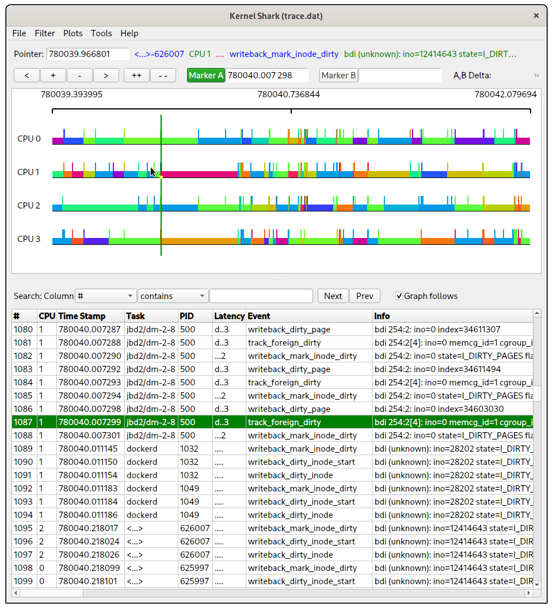

# State of the art {#sec:sota}

This chapter presents a conceptual overview of the current state of the relevant kernel subsystems and APIs we'll be working with during this project. The central part to analyze is the **memory (VM) subsystem**, which is directly responsible of the writeback cache, but as we'll see later, the **block I/O subsystem** and **filesystem (VFS) layer** are of special importance as well. Those are presented within sections \ref{subsec:io-stack} & \ref{subsec:writeback-cache}.

During analysis, we'll probably need to get insight on what is happening in the kernel. For complexity and practicity, this should be preferably done in a *non-invasive way* that avoids modifying the kernel or altering the results of the experiments themselves. Section \ref{subsec:tracing} presents an overview of the currently available mechanisms for tracing & debugging the Linux kernel.

When developing a possible solution —be it in form of kernel patches, loadable modules or userspace daemons— we'll likely rely on **accounting mechanisms** to track resource usage of (groups of) tasks and provide fairness. **Resource control** mechanisms will also be needed to enforce limits on (groups of) tasks, in the case of a userspace daemon. Section \ref{subsec:resource-control} details relevant accounting & control mechanisms readily available in Linux.

Finally, section \ref{subsec:other-technologies} details other technologies used in this thesis.

## Linux and the I/O stack {#subsec:io-stack}

This project is centered around the Linux kernel, and we'll be working on the **mainline version** at this time.

#### Flow of an I/O operation

Before beginning work, it was important to have an overview of the whole I/O stack in Linux, even if simplified.
When an I/O operation is issued from userspace upon a **mounted filesystem**, the following happens:

1. **VFS:** The \ac{VFS} (short for 'Virtual File System') layer handles the operation and calls the appropriate handler on the corresponding filesystem.

2. **Writeback cache:** The pages holding data to be written are marked as *dirty*. The **memory subsystem** (also called VM or MM) keeps track of dirty pages. The VFS operation then usually completes immediately, and at a later time, kernel workers enqueue (some of) the dirty pages to be actually written to the underlying block device. The pages are now in *writeback* state.

3. **BIO:** At this point, the operation is called a \ac{BIO} ---short for 'Block I/O'--- and it's handled by the **block layer**. It's placed on a per-device queue[^no-queue] (or set of queues), and the **I/O scheduler** (or elevator) selects operations from that queue and issues them to the hardware (disk drive). There are many elevators on Linux, such as `bfq` (which provides fair scheduling, explained in section \ref{subsec:resource-control}) or `noop` which is simple \ac{FCFS}.

   [^no-queue]: Some special block devices (like loop devices, or the device mapper) don't use a queue or I/O scheduler.

4. **Disk drive:** When the BIO is selected from the queue, the block driver issues it to the drive. After this, the operation is complete. However, the disk drive itself is often capable of caching the received operations. Since this caching layer is in hardware it's usually transparent to the kernel, except for the need to issue cache flushes when requested. Utilities like `hdparm` may be used to enable or disable the drive's cache.

If the I/O operation is directly upon an open block device, it goes directly to step 3 and isn't of interest. Also of note is that the VFS layer does have some internal caches for \ac{inode}s and \ac{dentry}s, but this doesn't seem to be relevant either.

Step 2 (the writeback cache) is what we'll work with, and its behaviour and interface was further researched and is explained in section \ref{subsec:writeback-cache}.

{#fig:io-stack-flow height=100%}

Figure \ref{fig:io-stack-flow} shows a representation of the flow. Please note how the page cache (i.e. the VM layer) isn't *after* the VFS layer, but *next to it*. As will be seen later, these layers interact in both directions.

#### Skipping the cache

Some operations may skip the writeback cache. In this case step 2 is not performed (thus, the memory subsystem is not involved); the I/O operation is immediately scheduled and completes when issued to the disk. There are many ways for this to happen:

- From userspace, if the file was open with `O_DIRECT`. This is a POSIX flag that does precisely that; it instructs operations on the file to skip caching.

  A related option is `O_SYNC`, which instructs data to be written synchronously to disk. They have different meanings, but `O_SYNC` involves among other things skipping the cache.

- By mounting the filesystem in `sync` mode (versus `async` mode, the default). This causes all operations on that filesystem to skip caching. A command like the following may be uesd to disable the writeback cache, on the fly, in the root filesystem:

  ~~~ bash
  mount -o remount,sync /
  ~~~

(This list isn't exhaustive.)

\clearpage
## The writeback cache {#subsec:writeback-cache}

#### Introduction

The writeback cache is a subset of the functionality provided by the VM's **page cache**. The page cache is an essential component in any general purpose OS, whose main intent is to reduce I/O operations on the underlying block device and improve perfomance.

Essentially, the page cache puts free memory pages to good use by mapping them to storage. "Free" in this context approximately means "pages not reserved by the kernel, network buffers or user processes". (This hasn't always been that way, though; some time ago, swappable process memory was considered free as well. \cite{commit-free-pages})

In that regard, **writeback caching** allows writes to be cached as well, and performed at a later time. This is useful for two important reasons:

 - Tasks can continue their work without being having to wait for I/O writes, which means better latency and resource utilization, especially CPU efficiency.

 - Prevents 'bumpiness' (greatly varying latencies) in the physical device from damaging the performance of tasks. This is especially relevant in "read-write loops" (i.e. a download from the network into disk) which greatly reduce their throughput if there are unstabilities in one of the ends \cite{commit-soft-throttling}.

 - I/O is submitted to the disk in bulks, which allows the I/O scheduler (or elevator) to build efficient schedules for their transfer.

Conceptually, it acts like a large buffer for writes.

#### General operation

Writeback caching works by tracking pages that become **dirty**, i.e. modified with respect to what's stored in the block device. Pages can be modified by regular operations on open files, or through other means such as mapped file memory.

Kernel worker tasks wake up periodically and transition some of the pages into **writeback** state, which means they're being written to the block device (resulting in one or more in-progress BIOs). This is done according to some criteria, such as how long the page has been dirty, or whether the current amount of dirty pages surpasses a configured **background dirty threshold**.

Once the page has been written (the BIO has finished), it's marked as clean and is now eligible to be removed from the cache.

#### Integration with VFS

It's a complicated component, because even though part of the memory management layer (VM), it has to coordinate with the VFS layer to maintain file-to-storage mappings and flush changes to disk when either of the parts request it (i.e. `sync` has been called, or the system is running low on memory).

And this integration between both components is often tricky, because the VFS layer always works in terms of *inodes*, whereas the VM layer always works in terms of pages \cite{docs-inodes-pages-problem}. Many pages can belong to the same inode.

#### Throttling

Like every buffer with finite capacity, the writeback cache needs a mechanism to throttle \ac{task}s that dirty pages to prevent it from filling indefinitely.

The main user-facing parameter to control this throttling is the **dirty threshold**, which defines the maximum percentage[^percentage] of the *free memory* (see above) in the system that can ever hold dirty pages[^dirty-pages]. Together with the **background dirty threshold** mentioned before, these define most of the throttling characteristics.

[^percentage]: Modern kernels allow defining an absolute amount of memory instead of a percentage of a dynamic value \cite{lkml-thresholds}. This is useful in systems with lots of RAM, as only *integer* percentages are accepted.

[^dirty-pages]: In most contexts, especially throttling, *dirty pages* includes pages in writeback state as well.

Previously, throttling seemed to be simple: when the dirty threshold is surpassed, new writes are no longer cached and effectively become synchronous (i.e. complete after processed by the block device). This was hurting interactivity and performance, and was later replaced by a **soft-throttling** scheme based on scheduler rate-limiting \cite{commit-soft-throttling}.

\begin{figure} \hypertarget{fig:curve-global}{%
  \centering
  \input{img/sota/throttling_curve_global}
  \caption{Representation of the global throttling curve, according to \protect\cite{source-writeback-curve}}\label{fig:curve-global}
} \end{figure}

\begin{figure} \hypertarget{fig:curve-bdi}{%
  \centering
  \input{img/sota/throttling_curve_bdi}
  \caption{Representation of the per-block device throttling curve, according to \protect\cite{source-writeback-curve}}\label{fig:curve-bdi}
} \end{figure}

Instead, processes now begin to be throttled *before* the dirty threshold is reached (at around the midpoint between it and the background dirty threshold, called the **setpoint**), and the pauses are designed to increase as the dirty limit is approached. The details are a bit more complicated: the curve that governs the throttling is represented in figure \ref{fig:curve-global}, the curve parameters are marked in blue \cite{source-writeback-curve}.

Furthermore, the kernel supports block device-specific throttling, which is intended to apply backpressure from the disk queues into the cache & applications. It's enabled through `CONFIG_BLK_WBT` and implemented through a separate curve, represented in figure \ref{fig:curve-bdi}. The source code appears to indicate that the minimum of both curves is in effect.

#### Unfairness

However, the throttling seems to be applied the same way no matter the task. There is a manual exception for tasks that have the `PF_LOCAL_THROTTLE`, which get throttled in less cases, but little more. This is expected, given that the memory subsystem has reduced capability of tracking the ownership of each page (but see section \ref{subsec:resource-control}).

The block device *does* seem to be taken into account, as we saw, but this doesn't help on most Linux installs which have all the system in one disk.

Taking that into account, it's reasonable to expect the same throttling applied to innocent, non-cache-starving processes than is being applied to the starving ones. Also, workers don't seem to apply any fairness when selecting pages for writeback.

#### Existing parameters {#par:cache-parameters}

Writeback cache parameters can be adjusted on the fly through the sysctl interface \cite{docs-sysctl-vm}. These are the relevant ones:

\begin{description}
\item[\mintinline{text}{vm.dirty_background_ratio}]
    The threshold, as a percentage of free memory, at which dirty pages start to be transitioned to \emph{writeback} state (default: \SI{10}{\percent}).
\item[\mintinline{text}{vm.dirty_background_bytes}]
    Like \mintinline{text}{vm.dirty_background_ratio}, but specified as an absolute quantity in bytes (default: none).
\item[\mintinline{text}{vm.dirty_ratio}]
    Target maximum dirty + writeback pages, as a percentage of free memory (default: \SI{20}{\percent}).
\item[\mintinline{text}{vm.dirty_bytes}]
    Like \mintinline{text}{vm.dirty_ratio}, but specified as an absolute quantity in bytes (default: none).
%
\item[\mintinline{text}{vm.dirty_writeback_centisecs}]
    Interval, in centisecs, at which kernel workers wake up to write dirty pages (default: \SI{5}{\second}).
\item[\mintinline{text}{vm.dirty_expire_centisecs}]
    Time, in centisecs, after which dirty pages are always written to disk regardless of threshold (default: \SI{30}{\second}).
%
%\item[\mintinline{text}{vm.dirtytime_expire_seconds}]
%\item[\mintinline{text}{vm.laptop_mode}]
%\item[\mintinline{text}{vm.vfs_cache_pressure}]
\end{description}

Some parameters may be adjusted per block device as well, but aren't detailed here for brevity and because of its limited use for this project.

## Kernel tracing tools {#subsec:tracing}

When performing the experiments, we'll likely need to debug the kernel in some way to better understand what's happening. Methods like traditional debugging (kgdb) are out of question because we're trying to analyze behaviour over time, and the problem is hard to reproduce precisely. In addition to that, we'd like debugging to be as unobtrusive as possible and avoid modifying the experiment itself (which is tricky, because we're debugging the VM & FS).

Thus, *tracing* seems to be what we need. Available kernel tracing mechanisms were researched; this section presents the most relevant ones.

#### The kernel tracer (ftrace)

Linux has a generic tracing system, which consumes **events** from multiple sources and aggregates them into a ringbuffer. Events are encoded in a binary format and include a timestamp (many clock sources are available), PID, CPU number and event-specific fields.

The tracer has a flexible filter system. Specific events may be enabled or disabled in many ways: either manually, for some time, or in response to another event being fired. This allows to pin down selected events, which is relevant in situations like this one, where interesting data may be buried in a frequently logged event (I/O). There's also some support for aggregating data into histograms, for instance.

Userspace can safely consume the ringbuffer and store it somewhere via the `splice` syscall, which is handy (as the process itself may get throttled). There's also a text-based ringbuffer consumer, but that doesn't support `splice`.

Among the event sources supported are **tracepoints** (explained below), an included **function tracer**, and other profilers. Userspace can also log custom data into the ringbuffer, in the form of `print` events.

We won't go into the details of the user interface, for brevity and because this will be handled by a user-space tool (presented later).

#### Tracepoints

Tracepoints are a debugging mechanism. They are statically inserted in kernel code through a macro, at points of interest. Then, through the API, the user can supply a callback that will be injected at the tracepoint they wish. The only cost of tracepoints, if enabled, is a no-op instruction when not in use \cite{docs-tracepoints}.

They can also serve as event sources. When inserting a tracepoint, the developer can specify additional *glue code* specifying the event name, fields and their representation. The tracepoint may then be enabled in the tracer and will generate an event every time it's hit \cite{tracepoints-events}.

Tracepoints are organized in *subsystems*. In our case, we're mostly interested in the `writeback` subsystem, and specifically in the following events, which were identified to be useful in getting a general overview of the state of the cache:

 - `writeback:global_dirty_state`: This tracepoint fires conditionally at the end of the `domain_dirty_limits` function, which calculates the thresholds mentioned earlier from the configured percentages of free memory. The event reports:

    \begin{description}
    \item[\mintinline{text}{nr_dirty}]
      Current number of pages in dirty state
    \item[\mintinline{text}{nr_writeback}]
      Current number of pages in writeback state
    \item[\mintinline{text}{background_thresh}]
      Calculated background dirty threshold, in pages
    \item[\mintinline{text}{dirty_thresh}]
      Calculated dirty threshold, in pages
    \item[\mintinline{text}{dirty_limit}]
      Not completely sure what this is, seems to be the absolute limit after which all operations still become synchronous. It's higher than \mintinline{text}{dirty_thresh}.
    \item[\mintinline{text}{nr_dirtied}]
      Accumulated counter of dirtied pages
    \item[\mintinline{text}{nr_written}]
      Accumulated counter of pages written to disk
    \end{description}

 - `writeback:balance_dirty_pages`: This tracepoint is placed in multiple points of the `balance_dirty_pages` function, which holds the main / root logic responsible for throttling. It's periodically called for processes that dirty pages, and regulates the amount of throttling (i.e. ratelimit) applied to them.
 
    The event reports too many fields to list them here, but amongst them there's the amount of dirty pages, the parameters (and input) to the throttling curves, and the resulting ratelimit for the task.

Other relevant events include the `syscall` subsystem, which has two events for every possible syscall (enter and exit) and allows similar functionality than `strace`.

#### Kprobes

A more recent technology, Kprobes (originally part of Dprobes) allows injecting code on arbitrary positions in memory, barring a few exceptions. They are essentially dynamic tracepoints. How this is accomplished depends on the architecture, but it generally involves patching the instruction at the supplied address, replacing it with a jump to user code, and then executing that missing instruction at the end (before resuming normal execution).

Kprobes are useful as they allow patching any function or spot on the fly. There's also a second type of Kprobes, called Kretprobes, that fire when an arbitrary function returns.

Like tracepoints, Kprobes has a kernel API. However, it can be used together with the tracer as event sources, which is convenient \cite{docs-kprobe-tracing}. They can also invoke BPF programs. Both of these solutions are entirely user-space.

To register Kprobes as event sources, the user writes entries to:

~~~
/sys/kernel/tracing/dynamic_events
~~~

These entries specify what info should be obtained and how (i.e. registers, variables, arguments, dereferencing), the symbol+offset to insert the Kprobe at, and an event name. This then appears among the other events and may be enabled or disabled as usual.

#### \ac{BPF}

{#fig:bpf-tools width=100%}

Short for Berkeley Packet Filter, it's a VM (Virtual Machine) that lives in the kernel, along with its bytecode format. BPF allows user-space to upload custom, architecture-independent programs that are interpreted in kernel-space at certain contexts.

It is primarily designed to be safe and compact: the kernel verifies the bytecode before running it to make sure there's no infinite loops, etc.

BPF was originally created to filter network packets when capturing traffic, and the first version has been renamed to *classical BPF* (or simply, cBPF). The new version, *extended BPF* (eBPF), performs better and allows the programs to communicate among themselves and with user-space, through shared data structures \cite{article-ebpf}.

Since then, BPF has found more and more uses. A very powerful one is **attaching BPF programs to Kprobes and tracepoints**. This (especially with BCC, see below) provides a powerful way to inspect kernel structures at an arbitrary point of execution that is easy, safe, portable and unobtrusive, entirely from user-space (i.e. instead of modifying the kernel or writing a kernel module).

Programs are verified and can only read memory, not modify it, so it's guaranteed that they won't damage the system. BPF Kprobes are thus safe to load even in production systems. A number of diagnostic tools and possibilities have been made possible, see figure \ref{fig:bpf-tools}.

#### User-space solutions

Until now we've specifically covered available kernel technologies. User-space tools have been created to make the use of some of them easier, and it's worth looking into them due to the limited scope of a degree thesis.

 - **trace-cmd**: This is the official user-space tool for the kernel tracer. A bit unmantained, but seems to be feature complete and easy to use. It is able to configure the tracer and log events to a single `trace.dat` file safely using `splice`, and handles some other technicalities.

   {#fig:kernelshark width=100%}

   It also contains libraries for parsing the event binary format, and a Python interface which can be very handy. Also included is **kernelshark** (figure \ref{fig:kernelshark}), a graphical viewer for event capture files produced by `trace-cmd`. The format is designed for efficiency, and kernelshark can quickly open logs with millions of events.

 - **blktrace**: Tool that listens for events logged from the block layer, and relayed through debugfs in a similar way to the tracer. Contains very detailed info about block I/O including scheduler operation, driver operation, queues, latencies...

 - **perf**: Kernel profiler. Not investigated as it appears of little relevance to the project.

And some tools are more generic, allowing the user to script their behaviour:

 - **BCC**: Set of tools that make BPF development significantly easier. These include:
 
    - Toolchain that allows BPF programs to be compiled from C code, linked against kernel headers, validated, etc.

    - Generic library that can invoke the toolchain, load the (resulting) BPF programs into the kernel, and manipulate the shared structures from user-space. The library has a Python interface as well.

   The potential of BCC when combined with Kprobes is huge (see figure \ref{fig:bpf-tools}), but has the problem of still being low level. Examples provided by the project include: counting task switches from/to PIDs, tracing data generated by urandom, inspecting KVM, ...

 - **SystemTap**: An integrated framework for profiling and tracing the system. It defines its own scripting language and is able to use many kernel technologies under the hood. Higher level than BCC, although probably not as powerful.

## Resource control & accounting {#subsec:resource-control}

This section details kernel technologies explored in the development phase of the proof-of-concept. These allow us to impose restrictions on resource consumption from (groups of) processes, which will hopefully be useful in mitigating the adverse effects of writeback caching.

There's also some mention of APIs for resource accounting, which allow us to query resource consumption and will be useful to identify relevant processes and measures to take.

#### \ac{cgroups}

- explain v1 and v2
  - difficulty of choosing... ideally our deamon should support both but we'll focus on v1 because it's used by systemd and limited scope
- different controllers

#### Memory cgroups (\ac{memcg})

#### Block I/O cgroups (\ac{blkio})

#### \ac{BFQ} scheduler

#### Process stats APIs

- explain `/proc`
- explain \ac{netlink} API

## Other used techologies {#subsec:other-technologies}

#### \ac{UML}

Short for User Mode Linux, this is a 'virtual' architecture shipped with Linux that allows it to be compiled as a regular executable. The kernel can then be 'booted' by simply executing it, and runs as a regular user-space process inside the host kernel \cite{docs-uml}.

In essence, it's a light way (in terms of setup) to run a virtual machine, requires *no privileges*, boots quickly and is fairly portable (and also fun). It is not used in production, since it isn't especially secure or performant when compared to using a proper hypervisor that takes advantage of hardware acceleration.

Using UML only requires setting `ARCH=um` when compiling the kernel. `make menuconfig` will show some UML-specific related options, such as whether to compile a 64-bit kernel and the processor type. `make` will then produce a `linux` executable. To boot the kernel, invoke this executable supplying kernel parameters as command-line arguments. Keep in mind these arguments are internally joined with spaces before processing.

Files may be exposed to the kernel as block devices, through the UBD driver: add `ubdX=file` arguments such as `ubda=/tmp/rootfs` and it will appear as `/dev/ubda`. Copy-on-write may also be used by supplying a comma-separated list of files. UML also ships with a 'magic filesystem' that exposes the host filesystem: it's called hostfs and may be used like this:

~~~ bash
UML$ mount -t hostfs none /host -o /home/dev/uml
UML$ cat /host/foo  # accesses /home/dev/uml/foo in the host
~~~

This causes problems with permissions and privileged operations when the kernel runs as an unprivileged user, because not even UML root will be able to modify the ownership of files, for instance. To remediate this, an additional filesystem is provided that stores the metadata separately, but it is not relevant to the project.

Other peripherals are provided as well, such as multiple options to provide network (TUN or TAP) and serial lines / consoles. The amount of physical memory used by UML may be adjusted through the `memory` option, i.e. `memory=150M`.
